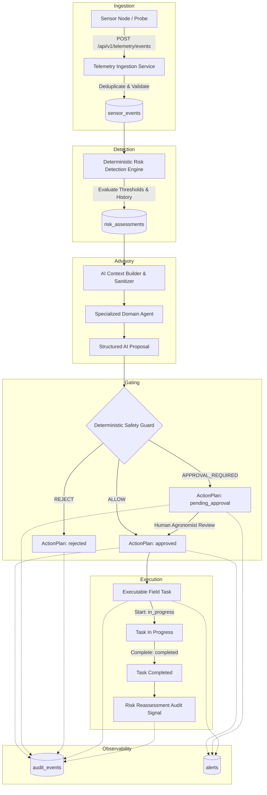

# FarmOps AI — End-to-End Demo Workflow & Integration Guide

This document describes the complete autonomous agronomic workflow implemented in the FarmOps AI backend. It provides instructions for executing the deterministic demo pipeline via both the CLI runner and the authenticated REST API.

---

## 1. High-Level Architecture Flow



---

## 2. Available Demo Scenarios

| Scenario Key | Primary Telemetry Trigger | Target Risk Detected | Safety Guard Decision | Task Execution Behavior |
|---|---|---|---|---|
| `water_stress` (Default) | Soil Moisture: $16.5\%$, Temp: $34.5^\circ\text{C}$, RH: $32.0\%$ | `WATER_STRESS` (Critical) | `ALLOW` | Plan auto-approved $\rightarrow$ Task created $\rightarrow$ Executed $\rightarrow$ Completed $\rightarrow$ Reassessment signal emitted. |
| `pest_disease` | Air Humidity: $89.5\%$, Air Temp: $25.0^\circ\text{C}$ | `PEST_DISEASE_RISK` | `ALLOW` | Microclimate pathogen window detected $\rightarrow$ Scouting protocol task created & completed. |
| `nutrient_deficiency` | Nitrogen: $8.0\text{ ppm}$, Phosphorus: $6.5\text{ ppm}$, Potassium: $9.0\text{ ppm}$, pH: $5.1$ | `NUTRIENT_DEFICIENCY` | `ALLOW` | Severe N/P/K depletion detected $\rightarrow$ Soil core sampling task generated without arbitrary chemical dosing. |
| `chemical_approval` | Critical moisture + synthetic pesticide advisory | `WATER_STRESS` / `PEST_DISEASE_RISK` | `APPROVAL_REQUIRED` | Flagged for mandatory agronomist review. Halts before task creation until explicit human approval. |
| `prohibited_actuator` | Critical moisture + direct hardware valve override | `WATER_STRESS` | `REJECT` | Prohibited autonomous actuator command rejected by policy. Action plan rejected, zero physical tasks spawned. |

---

## 3. Running the Demo via CLI

The backend includes a standalone CLI runner using production database and service pipelines.

```bash
cd backend

# 1. Run default Water Stress scenario (Full end-to-end)
.\.venv\Scripts\python.exe -m app.demo.run_demo

# 2. Run Pest & Disease scenario
.\.venv\Scripts\python.exe -m app.demo.run_demo --scenario pest_disease

# 3. Run Sensitive Chemical scenario with approval halt
.\.venv\Scripts\python.exe -m app.demo.run_demo --scenario chemical_approval --no-auto-approve

# 4. Output raw JSON format
.\.venv\Scripts\python.exe -m app.demo.run_demo --scenario water_stress --json
```

### Sample CLI Output
```
======================================================================
 FARMOPS AI — END-TO-END DEMO EXECUTION [demo-3f82a10b]
======================================================================
 Scenario         : water_stress
 Status           : SUCCESS
 Farm ID          : 3a2e1d0f-4822-41de-8409-bf29048a1290
 Zone ID          : 8c4d1123-99ab-4122-8172-ba00918ef002
 Device ID        : 198e4f1a-b301-447a-89a1-778899001122
 Telemetry ID     : 5543211a-1122-4433-8877-aabbccddeeff
 Risk Detected    : water_stress (critical) -> 99aacc00-1122-3344-5566-778899aabbcc
 Safety Decision  : ALLOW
 Action Plan ID   : 44332211-5566-7788-9900-aabbccddeeff (State: completed)
 Task ID          : 12345678-abcd-ef01-2345-6789abcdef01 (State: completed)
 Reassessment Req : True
 Audit Events     : 8 recorded
 Alerts Fired     : 3 tracked
----------------------------------------------------------------------
 EXECUTION LOG:
  * [Stage 1] Resolved infrastructure: Farm 'Demo Autonomous Farm' (3a2e...), Zone 'Demo Sector Alpha' (8c4d...), Device 'Demo Moisture Node 01' (198e...)
  * [Stage 2] Ingested telemetry event 5543... (seq 1) with measurements: {'soil_moisture': 16.5, 'soil_temperature': 29.0, 'air_temperature': 34.5, 'air_humidity': 32.0}
  * [Stage 3] Detected 1 risk(s). Target Risk: WATER_STRESS (99aa...) | Severity: CRITICAL | Score: 0.92
  * [Stage 4] AI Agent 'water_stress_agent' generated proposal: 'Initiate calibrated drip cycle and review soil moisture gradient.' (Confidence: 0.95)
  * [Stage 5] Safety Guard Decision: ALLOW (Approval Required: False) | Flags: ['SAFE_ROUTINE_ADVISORY']
  * [Stage 5] Created ActionPlan 4433... | Status: APPROVED | Policy: ALLOW
  * [Stage 7] Field Task 1234... initialized in 'PENDING' state.
  * [Stage 7] Field Task 1234... transitioned to IN_PROGRESS.
  * [Stage 7] Field Task 1234... transitioned to COMPLETED.
  * [Stage 8] Verified risk_reassessment_requested signal emitted for Risk 99aa...
  * [Stage 8] Observability complete: 8 audit events and 3 alerts tracked.
======================================================================
```

---

## 4. Running the Demo via REST API

### 1. Check Demo Capabilities & Scenarios
```http
GET /api/v1/demo/status
```
**Response (`200 OK`)**:
```json
{
  "success": true,
  "message": "Demo pipeline is ready.",
  "data": {
    "status": "ready",
    "available_scenarios": [
      "water_stress",
      "pest_disease",
      "nutrient_deficiency",
      "chemical_approval",
      "prohibited_actuator"
    ],
    "supported_providers": ["mock", "gemini"],
    "deterministic_mode": true
  }
}
```

### 2. Execute Demo Workflow
```http
POST /api/v1/demo/run
Authorization: Bearer <access_token>
Content-Type: application/json

{
  "scenario": "water_stress",
  "auto_approve": true
}
```

**Response (`200 OK`)**:
```json
{
  "success": true,
  "message": "Demo pipeline 'water_stress' completed successfully.",
  "data": {
    "demo_run_id": "demo-3f82a10b",
    "scenario": "water_stress",
    "success": true,
    "farm_id": "3a2e1d0f-4822-41de-8409-bf29048a1290",
    "zone_id": "8c4d1123-99ab-4122-8172-ba00918ef002",
    "device_id": "198e4f1a-b301-447a-89a1-778899001122",
    "telemetry_event_id": "5543211a-1122-4433-8877-aabbccddeeff",
    "telemetry_measurements": {
      "soil_moisture": 16.5,
      "soil_temperature": 29.0,
      "air_temperature": 34.5,
      "air_humidity": 32.0
    },
    "risk_id": "99aacc00-1122-3344-5566-778899aabbcc",
    "risk_type": "water_stress",
    "risk_severity": "critical",
    "risk_score": 0.92,
    "ai_proposal": {
      "agent_type": "water_stress_agent",
      "risk_type": "water_stress",
      "recommendation": "Initiate calibrated drip cycle and review soil moisture gradient.",
      "rationale": "Critically depleted volumetric water content with elevated evapotranspiration rate.",
      "confidence": 0.95,
      "urgency": "high",
      "evidence_refs": ["soil_moisture: 16.5%", "air_temperature: 34.5°C"],
      "assumptions": ["Drip network operates at nominal 1.8 bar pressure"],
      "uncertainty": "Minor spatial variability in sensor root zone",
      "requires_human_review": false,
      "safety_notes": "Do not exceed maximum root-zone holding capacity."
    },
    "safety_decision": "ALLOW",
    "action_plan_id": "44332211-5566-7788-9900-aabbccddeeff",
    "approval_state": "completed",
    "task_id": "12345678-abcd-ef01-2345-6789abcdef01",
    "task_status": "completed",
    "audit_event_ids": [
      "audit-01-telemetry",
      "audit-02-risk-detected",
      "audit-03-plan-created",
      "audit-04-task-created",
      "audit-05-task-started",
      "audit-06-task-completed",
      "audit-07-reassessment-signal"
    ],
    "alert_ids": [
      "alert-01-risk",
      "alert-02-task-created",
      "alert-03-task-completed"
    ],
    "reassessment_requested": true,
    "execution_log": [
      "[Stage 1] Resolved infrastructure...",
      "[Stage 2] Ingested telemetry...",
      "[Stage 3] Detected WATER_STRESS risk...",
      "[Stage 4] AI Agent generated proposal...",
      "[Stage 5] Safety Guard Decision: ALLOW...",
      "[Stage 7] Field Task transitioned to COMPLETED...",
      "[Stage 8] Verified risk_reassessment_requested signal emitted..."
    ]
  }
}
```

---

## 5. Deterministic Safety Guarantees

1. **Advisory Separation**: AI proposals are strictly non-authoritative candidate recommendations.
2. **Deterministic Gating**: The rule-based `SafetyGuard` deterministically enforces chemical thresholds, cost caps, and prohibited actuator lockout regardless of LLM confidence.
3. **No Direct Actuators**: The backend contains no autonomous actuator triggers or physical override mechanisms.
4. **Tamper-Evident Audit Trail**: Every state transition (telemetry ingest, risk detection, AI proposal, plan approval, task start, completion, and reassessment) is recorded immutably in `audit_events`.
5. **Zero Credential Exposure**: Passwords, JWT secrets, database connection strings, and Gemini API keys are completely stripped and never recorded in logs or audit payloads.
