# FarmOps AI — Frontend Developer Integration Guide

This guide is designed for **Member 2 (Frontend Developer)** to quickly connect a Next.js / Vite React frontend application to the **FarmOps AI Backend**.

---

## 1. Quick Architecture Overview

```mermaid
graph LR
    subgraph Frontend["Frontend App (Next.js / Vite)"]
        UI["Dashboard UI"]
        SDK["@supabase/supabase-js"]
        Client["apiClient (Axios/Fetch)"]
    end

    subgraph Supabase["Supabase Cloud"]
        Auth["Supabase Auth (JWT)"]
    end

    subgraph Backend["FarmOps AI Backend (FastAPI)"]
        API["/api/v1 Router"]
        Guard["SafetyGuard & RBAC"]
        DB[("PostgreSQL")]
    end

    UI --> SDK
    SDK -->|1. Login & Token| Auth
    SDK -->|2. Access Token| Client
    Client -->|3. Authorization: Bearer <token>| API
    API --> Guard
    Guard --> DB
```



---

## 2. Authentication Flow

FarmOps AI uses **Supabase Auth** as the identity provider. The frontend authenticates directly against Supabase and passes the resulting JWT in the `Authorization` header.

### A. Install Dependencies
```bash
npm install @supabase/supabase-js axios @tanstack/react-query
```

### B. Initialize Supabase Client (`lib/supabase.ts`)
```typescript
import { createClient } from "@supabase/supabase-js";

const supabaseUrl = process.env.NEXT_PUBLIC_SUPABASE_URL || "https://<your-project>.supabase.co";
const supabaseAnonKey = process.env.NEXT_PUBLIC_SUPABASE_ANON_KEY || "<your-anon-key>";

export const supabase = createClient(supabaseUrl, supabaseAnonKey);
```

### C. Retrieve Access Token
```typescript
export async function getAccessToken(): Promise<string | null> {
  const { data: { session } } = await supabase.auth.getSession();
  return session?.access_token || null;
}
```

---

## 3. Standard API Client Configuration

Here is a production-ready Axios client with token injection and unified error handling (`lib/apiClient.ts`).

```typescript
import axios, { AxiosError, InternalAxiosRequestConfig } from "axios";
import { supabase } from "./supabase";
import { APIResponse, APIError } from "@/docs/frontend-types";

const API_BASE_URL = process.env.NEXT_PUBLIC_API_URL || "http://localhost:8000/api/v1";

export const apiClient = axios.create({
  baseURL: API_BASE_URL,
  headers: {
    "Content-Type": "application/json",
  },
  timeout: 30000, // 30s timeout
});

// Automatic Bearer Token Interceptor
apiClient.interceptors.request.use(async (config: InternalAxiosRequestConfig) => {
  const { data: { session } } = await supabase.auth.getSession();
  if (session?.access_token) {
    config.headers.set("Authorization", `Bearer ${session.access_token}`);
  }
  return config;
});

// Unified Response & Error Interceptor
apiClient.interceptors.response.use(
  (response) => response,
  async (error: AxiosError<APIResponse<any>>) => {
    if (error.response) {
      const status = error.response.status;
      const errorData = error.response.data?.error;

      switch (status) {
        case 401:
          // Session expired or invalid -> trigger Supabase sign out / refresh
          console.warn("[API] 401 Unauthorized — Refreshing session or redirecting to login");
          await supabase.auth.signOut();
          if (typeof window !== "undefined") {
            window.location.href = "/login";
          }
          break;

        case 403:
          console.error(`[API] 403 Forbidden: ${errorData?.message || "Insufficient permissions for this farm."}`);
          break;

        case 404:
          console.warn(`[API] 404 Not Found: ${errorData?.message || "Requested resource does not exist."}`);
          break;

        case 422:
          console.error(`[API] 422 Validation Error:`, error.response.data);
          break;

        case 500:
        case 502:
        case 503:
          console.error(`[API] Server Error (${status}): ${errorData?.message || "Please try again later."}`);
          break;
      }
    }
    return Promise.reject(error);
  }
);
```

---

## 4. Key Frontend Integration Workflows

### Workflow 1: Farm & Zone Dashboard
Fetch active farms, zones, and telemetry time-series:

```typescript
import { apiClient } from "@/lib/apiClient";
import { APIResponse, Farm, Zone, SensorEventResponse } from "@/docs/frontend-types";

// 1. Fetch Farms List
export async function getFarms(): Promise<Farm[]> {
  const res = await apiClient.get<APIResponse<Farm[]>>("/farms");
  return res.data.data || [];
}

// 2. Fetch Farm Details with Zones
export async function getFarmDetails(farmId: string): Promise<Farm> {
  const res = await apiClient.get<APIResponse<Farm>>(`/farms/${farmId}`);
  if (!res.data.data) throw new Error("Farm not found");
  return res.data.data;
}

// 3. Fetch Recent Telemetry Readings for Charts
export async function getZoneTelemetry(farmId: string, zoneId: string): Promise<SensorEventResponse[]> {
  const res = await apiClient.get<APIResponse<SensorEventResponse[]>>(`/telemetry/${farmId}/events`, {
    params: { zone_id: zoneId, limit: 100 },
  });
  return res.data.data || [];
}
```

---

### Workflow 2: Risk Monitoring & AI Advisory

```typescript
import { apiClient } from "@/lib/apiClient";
import { APIResponse, RiskAssessment, AIEvaluationResponse } from "@/docs/frontend-types";

// 1. Query Active Risks
export async function getActiveRisks(farmId: string): Promise<RiskAssessment[]> {
  const res = await apiClient.get<APIResponse<RiskAssessment[]>>(`/farms/${farmId}/risks`, {
    params: { status: "open" },
  });
  return res.data.data || [];
}

// 2. Request AI Advisory Reasoning & Safety Policy Decision
export async function requestAIEvaluation(riskId: string): Promise<AIEvaluationResponse> {
  const res = await apiClient.post<APIResponse<AIEvaluationResponse>>("/ai/evaluate-risk", {
    risk_id: riskId,
  });
  if (!res.data.data) throw new Error("AI evaluation failed");
  return res.data.data;
}
```

---

### Workflow 3: Action Plan Human Sign-Off

```typescript
import { apiClient } from "@/lib/apiClient";
import { APIResponse, ActionPlan } from "@/docs/frontend-types";

export async function approveActionPlan(planId: string, notes: string): Promise<ActionPlan> {
  const res = await apiClient.post<APIResponse<ActionPlan>>(`/action-plans/${planId}/approve`, {
    decision: "approved",
    review_notes: notes,
  });
  if (!res.data.data) throw new Error("Approval failed");
  return res.data.data;
}
```

---

### Workflow 4: Field Tasks Execution Lifecycle

```typescript
import { apiClient } from "@/lib/apiClient";
import { APIResponse, Task } from "@/docs/frontend-types";

// Start Task
export async function startTask(taskId: string, notes?: string): Promise<Task> {
  const res = await apiClient.post<APIResponse<Task>>(`/tasks/${taskId}/start`, { notes });
  return res.data.data!;
}

// Complete Task
export async function completeTask(taskId: string, completionNotes: string, operatorId: string): Promise<Task> {
  const res = await apiClient.post<APIResponse<Task>>(`/tasks/${taskId}/complete`, {
    completion_notes: completionNotes,
    completed_by: operatorId,
  });
  return res.data.data!;
}
```

---

### Workflow 5: One-Click Demo Pipeline

```typescript
import { apiClient } from "@/lib/apiClient";
import { APIResponse, DemoRunResult, DemoScenario } from "@/docs/frontend-types";

export async function triggerDemoPipeline(
  scenario: DemoScenario = "water_stress",
  autoApprove = true
): Promise<DemoRunResult> {
  const res = await apiClient.post<APIResponse<DemoRunResult>>("/demo/run", {
    scenario,
    auto_approve: autoApprove,
    farm_name: "Demo Autonomous Farm",
  });
  if (!res.data.data) throw new Error(res.data.message || "Demo run failed");
  return res.data.data;
}
```

---

## 5. Polling & Real-Time Guidance

For live dashboard telemetry and alerts without WebSockets, use `@tanstack/react-query` or SWR with the following suggested refresh intervals:

| Query Type | Recommended `refetchInterval` | Rationale |
| :--- | :--- | :--- |
| **Active Alerts** | `10_000` ms (10s) | Fast operator notification for critical thresholds |
| **Zone Telemetry** | `15_000` ms (15s) | Reflects continuous IoT sensor streams |
| **Active Risks** | `20_000` ms (20s) | Detects new risk engine evaluations |
| **Field Tasks** | `15_000` ms (15s) | Updates field execution states |
| **Farm / Zones Metadata** | `60_000` ms (1m) | Infrequent changes |

### Example React Query Hook
```typescript
import { useQuery } from "@tanstack/react-query";
import { getZoneTelemetry } from "@/lib/api";

export function useZoneTelemetry(farmId: string, zoneId: string) {
  return useQuery({
    queryKey: ["telemetry", farmId, zoneId],
    queryFn: () => getZoneTelemetry(farmId, zoneId),
    refetchInterval: 15000, // 15 seconds
    staleTime: 10000,
  });
}
```

---

## 6. CORS & Environment Setup

### Local Development (`.env.local`)
```env
NEXT_PUBLIC_API_URL=http://localhost:8000/api/v1
NEXT_PUBLIC_SUPABASE_URL=https://<your-project>.supabase.co
NEXT_PUBLIC_SUPABASE_ANON_KEY=eyJhbGciOiJIUzI1NiIsIn...
```

The backend is pre-configured to allow CORS from:
- `http://localhost:3000` (Next.js default)
- `http://localhost:5173` (Vite default)
- `http://127.0.0.1:3000`
- `http://127.0.0.1:5173`

### Production Configuration
In staging or production, set `CORS_ORIGINS` in the backend environment to your hosted domain (comma-separated or JSON list, e.g. `https://farmops.app,https://dashboard.farmops.app`).

---

## 7. Status Code Cheat Sheet

- **`200 OK`**: Successful GET, PATCH, PUT, or RPC action. Inspect `data` property.
- **`201 Created`**: Successful entity creation (Farm, Zone, Device, Task, Plan, Observation).
- **`401 Unauthorized`**: Token missing, expired, or invalid. Clear session and redirect to login.
- **`403 Forbidden`**: Authenticated user is not a member of the requested `farm_id` or lacks required role.
- **`404 Not Found`**: Entity ID does not exist or user cannot view it.
- **`422 Unprocessable Entity`**: Payload format error (e.g. invalid GeoJSON, negative moisture, unsupported enum value).
- **`502 Bad Gateway`**: Upstream AI provider (e.g. Gemini LLM) timed out or failed. Retry with exponential backoff.

---

## 8. Backend Test Suite & Live AI Execution

- **Default Test Suite (`pytest -q`)**: 100% deterministic and runs in seconds using built-in mock providers and fixtures. It does not consume live Gemini API quota.
- **Live Gemini Integration Tests (`pytest -m live_ai`)**: Dedicated integration tests validating end-to-end LLM generation against Google Gemini APIs with active `GEMINI_API_KEY`.
- **Handling 429 Quota Exceeded**: If `pytest -m live_ai` returns HTTP 429 `RESOURCE_EXHAUSTED`, it indicates that the Google Gemini Free Tier rate limits (e.g. 5 requests/minute or 20 requests/day) have been reached on the configured API key.

